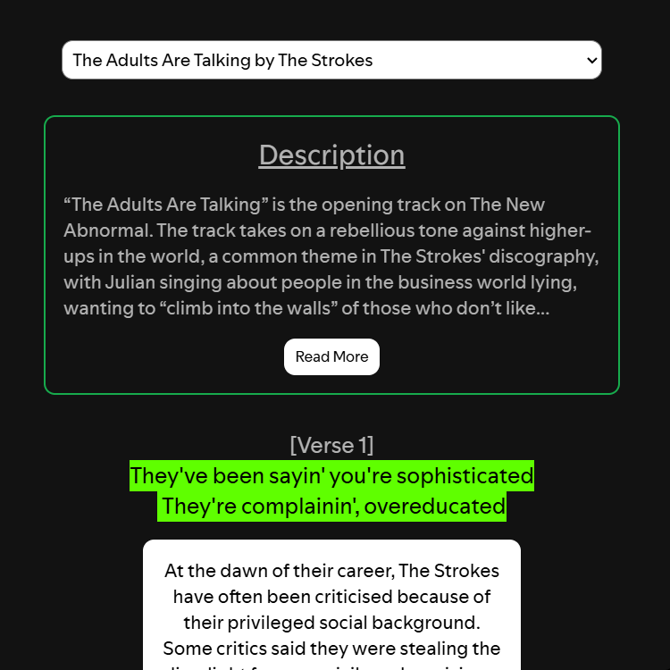
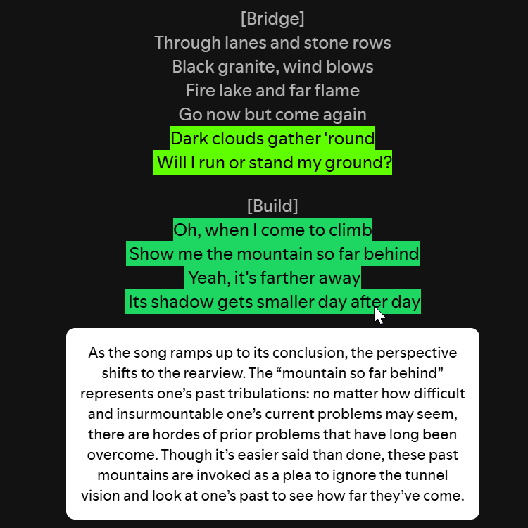

# Genius Annotations & Lyrics
Displays the current song's lyrics, annotations and description sourced from [Genius](https://genius.com)  
Includes a list of available translations, as well as the link to the song page on Genius at the bottom of the lyrics.

## Installation
### Automatic (Windows, Powershell)
1. Open Powershell
2. Run:
```
iwr -useb "https://raw.githubusercontent.com/aamiryatali/genius-annotations/refs/heads/main/install.ps1" | iex
```

### Manual
1. Download the latest release
2. Extract to your CustomApps folder (Windows default: ```%appdata%\spicetify\CustomApps```) 
3. Run:
```
spicetify config custom_apps genius-annotations
spicetify apply
```
Done.  
If installation was successful, this button should appear on the top left of Spotify:  


## Previews
### Description, lyrics and annotations


### Translations


### Annotations
